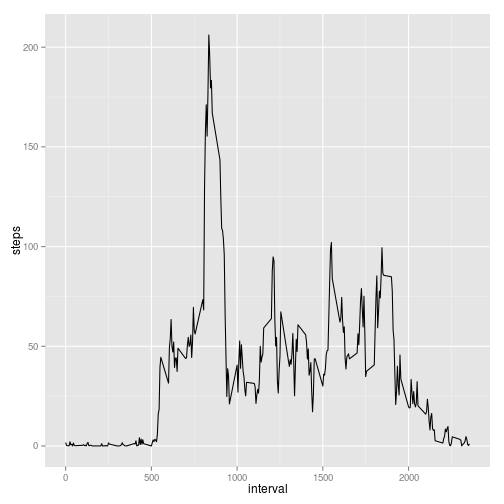

# Reproducible Research: Peer Assessment 1


## Loading and preprocessing the data
**1. Load the data**
**2. Process/transform the data (if necessary) into a format suitable for your analysis**

```r
data <- read.csv("activity.csv")
```


## What is mean total number of steps taken per day?
For this part of the assignment, you can ignore the missing values in
the dataset.

**1. Make a histogram of the total number of steps taken each day**

```r
dataAggregatedPerDay <- aggregate(list(steps = data$steps), list(day = data$date), 
    sum)
breaksNumber <- length(dataAggregatedPerDay$steps) - sum(is.na(dataAggregatedPerDay$steps))
qplot(steps, data = dataAggregatedPerDay, geom = "histogram", binwidth = 1000)
```

 

** 2. Calculate and report the *mean* and *median* total number of steps taken per day**

```r
mean.day <- mean(dataAggregatedPerDay$steps, na.rm = TRUE)
median.day <- median(dataAggregatedPerDay$steps, na.rm = TRUE)
```

After making the appropriated calculation we can see that the mean and median 
values are ***10766*** and ***10765***, respectively.
## What is the average daily activity pattern?

**1. Make a time series plot of the 5-minute interval (x-axis) and the average number of steps taken, averaged across all days (y-axis)**

```r
aggregated.daily.pattern <- aggregate(list(steps = data$steps), list(interval = data$interval), 
    mean, na.rm = TRUE)
qplot(interval, steps, data = aggregated.daily.pattern, geom = "line")
```

 


**2. Which 5-minute interval, on average across all the days in the dataset, contains the maximum number of steps?**


```r
max.interval.index <- which.max(aggregated.daily.pattern$steps)
max.daily.interval <- aggregated.daily.pattern$interval[max.interval.index]
```


The 5-minute interval that contains the maximum number of steps is the 
***104th*** element, with a value of 
***835***, that means 8:35 a.m. for the the activity daily 
pattern.

## Imputing missing values
Note that there are a number of days/intervals where there are missing
values (coded as `NA`). The presence of missing days may introduce
bias into some calculations or summaries of the data.

**1. Calculate and report the total number of missing values in the dataset**


```r
na.indices <- which(is.na(data$steps))
not.complete.cases <- length(na.indices)
```

All the missing values are in the *steps* column. The total number of missing 
values is ***2304*** steps, i.e. there are 
***2304*** rows in the data frame where we do not know the 
number of steps that corresponding to such intervals.

**2. Devise a strategy for filling in all of the missing values in the dataset.**

I decided to put in each missing values the value that appears for the same 
interval in the activity daily pattern. That is, I extract the values from the 
average of all the 5 minute intervals across all the days.

```r
impute.missing.value <- function(x) {
    aggregated.daily.pattern$steps[aggregated.daily.pattern$interval == data$interval[x]]
}
```


**3. Create a new dataset that is equal to the original dataset but with the missing data filled in.**


```r
data.with.imputed.missing.values <- data
imputed <- sapply(na.indices, impute.missing.value)
data.with.imputed.missing.values$steps[na.indices] <- imputed
```


**4. Make a histogram of the total number of steps taken each day and Calculate and report the *mean* and *median* total number of steps taken per day. Do these values differ from the estimates from the first part of the assignment? What is the impact of imputing missing data on the estimates of the total daily number of steps?**


```r
dataAggregatedPerDay.imputed <- aggregate(list(steps = data.with.imputed.missing.values$steps), 
    list(day = data.with.imputed.missing.values$date), sum)
qplot(steps, data = dataAggregatedPerDay.imputed, geom = "histogram", binwidth = 1000)
```

 


We can see that this new histogram is shifted (in the Y-axis) with respect to
the histogram based on the original data frame. This is due to the fact of imputing
new values for the missing values, increasing the number of overal steps in this way.


```r
mean.day.imputed <- mean(dataAggregatedPerDay.imputed$steps)
median.day.imputed <- median(dataAggregatedPerDay.imputed$steps)
```


After making the appropriated calculations we can see that the mean and median 
values when we work on the data frame with imputed missing values are 
***10766*** and ***1.0766 &times; 10<sup>4</sup>***, 
respectively. If we compare these values against the previous ones (those 
without taking into account missing values), we see that mean values are 
exactly equals whereas the median is a little bit different 
(***10765*** for the original data frame and 
***1.0766 &times; 10<sup>4</sup>*** for the same data frame with the imputed missing 
values). The closeness of the results is because we chose averaged data (for 
5-minute interval), and so we keep quite well the mean and median measures.
Concretely, if we compare in a single data frame how different are both data 
frames (the original and the imputed ones):


```r
library(xtable)
t1 <- merge(dataAggregatedPerDay, dataAggregatedPerDay.imputed, by = 1)
names(t1) <- c("Date", "original.estimate", "impute.estimate")
print(xtable(t1), type = "html")
```

<!-- html table generated in R 3.1.0 by xtable 1.7-3 package -->
<!-- Sat Jun 14 19:13:29 2014 -->
<TABLE border=1>
<TR> <TH>  </TH> <TH> Date </TH> <TH> original.estimate </TH> <TH> impute.estimate </TH>  </TR>
  <TR> <TD align="right"> 1 </TD> <TD> 2012-10-01 </TD> <TD align="right">  </TD> <TD align="right"> 10766.19 </TD> </TR>
  <TR> <TD align="right"> 2 </TD> <TD> 2012-10-02 </TD> <TD align="right"> 126 </TD> <TD align="right"> 126.00 </TD> </TR>
  <TR> <TD align="right"> 3 </TD> <TD> 2012-10-03 </TD> <TD align="right"> 11352 </TD> <TD align="right"> 11352.00 </TD> </TR>
  <TR> <TD align="right"> 4 </TD> <TD> 2012-10-04 </TD> <TD align="right"> 12116 </TD> <TD align="right"> 12116.00 </TD> </TR>
  <TR> <TD align="right"> 5 </TD> <TD> 2012-10-05 </TD> <TD align="right"> 13294 </TD> <TD align="right"> 13294.00 </TD> </TR>
  <TR> <TD align="right"> 6 </TD> <TD> 2012-10-06 </TD> <TD align="right"> 15420 </TD> <TD align="right"> 15420.00 </TD> </TR>
  <TR> <TD align="right"> 7 </TD> <TD> 2012-10-07 </TD> <TD align="right"> 11015 </TD> <TD align="right"> 11015.00 </TD> </TR>
  <TR> <TD align="right"> 8 </TD> <TD> 2012-10-08 </TD> <TD align="right">  </TD> <TD align="right"> 10766.19 </TD> </TR>
  <TR> <TD align="right"> 9 </TD> <TD> 2012-10-09 </TD> <TD align="right"> 12811 </TD> <TD align="right"> 12811.00 </TD> </TR>
  <TR> <TD align="right"> 10 </TD> <TD> 2012-10-10 </TD> <TD align="right"> 9900 </TD> <TD align="right"> 9900.00 </TD> </TR>
  <TR> <TD align="right"> 11 </TD> <TD> 2012-10-11 </TD> <TD align="right"> 10304 </TD> <TD align="right"> 10304.00 </TD> </TR>
  <TR> <TD align="right"> 12 </TD> <TD> 2012-10-12 </TD> <TD align="right"> 17382 </TD> <TD align="right"> 17382.00 </TD> </TR>
  <TR> <TD align="right"> 13 </TD> <TD> 2012-10-13 </TD> <TD align="right"> 12426 </TD> <TD align="right"> 12426.00 </TD> </TR>
  <TR> <TD align="right"> 14 </TD> <TD> 2012-10-14 </TD> <TD align="right"> 15098 </TD> <TD align="right"> 15098.00 </TD> </TR>
  <TR> <TD align="right"> 15 </TD> <TD> 2012-10-15 </TD> <TD align="right"> 10139 </TD> <TD align="right"> 10139.00 </TD> </TR>
  <TR> <TD align="right"> 16 </TD> <TD> 2012-10-16 </TD> <TD align="right"> 15084 </TD> <TD align="right"> 15084.00 </TD> </TR>
  <TR> <TD align="right"> 17 </TD> <TD> 2012-10-17 </TD> <TD align="right"> 13452 </TD> <TD align="right"> 13452.00 </TD> </TR>
  <TR> <TD align="right"> 18 </TD> <TD> 2012-10-18 </TD> <TD align="right"> 10056 </TD> <TD align="right"> 10056.00 </TD> </TR>
  <TR> <TD align="right"> 19 </TD> <TD> 2012-10-19 </TD> <TD align="right"> 11829 </TD> <TD align="right"> 11829.00 </TD> </TR>
  <TR> <TD align="right"> 20 </TD> <TD> 2012-10-20 </TD> <TD align="right"> 10395 </TD> <TD align="right"> 10395.00 </TD> </TR>
  <TR> <TD align="right"> 21 </TD> <TD> 2012-10-21 </TD> <TD align="right"> 8821 </TD> <TD align="right"> 8821.00 </TD> </TR>
  <TR> <TD align="right"> 22 </TD> <TD> 2012-10-22 </TD> <TD align="right"> 13460 </TD> <TD align="right"> 13460.00 </TD> </TR>
  <TR> <TD align="right"> 23 </TD> <TD> 2012-10-23 </TD> <TD align="right"> 8918 </TD> <TD align="right"> 8918.00 </TD> </TR>
  <TR> <TD align="right"> 24 </TD> <TD> 2012-10-24 </TD> <TD align="right"> 8355 </TD> <TD align="right"> 8355.00 </TD> </TR>
  <TR> <TD align="right"> 25 </TD> <TD> 2012-10-25 </TD> <TD align="right"> 2492 </TD> <TD align="right"> 2492.00 </TD> </TR>
  <TR> <TD align="right"> 26 </TD> <TD> 2012-10-26 </TD> <TD align="right"> 6778 </TD> <TD align="right"> 6778.00 </TD> </TR>
  <TR> <TD align="right"> 27 </TD> <TD> 2012-10-27 </TD> <TD align="right"> 10119 </TD> <TD align="right"> 10119.00 </TD> </TR>
  <TR> <TD align="right"> 28 </TD> <TD> 2012-10-28 </TD> <TD align="right"> 11458 </TD> <TD align="right"> 11458.00 </TD> </TR>
  <TR> <TD align="right"> 29 </TD> <TD> 2012-10-29 </TD> <TD align="right"> 5018 </TD> <TD align="right"> 5018.00 </TD> </TR>
  <TR> <TD align="right"> 30 </TD> <TD> 2012-10-30 </TD> <TD align="right"> 9819 </TD> <TD align="right"> 9819.00 </TD> </TR>
  <TR> <TD align="right"> 31 </TD> <TD> 2012-10-31 </TD> <TD align="right"> 15414 </TD> <TD align="right"> 15414.00 </TD> </TR>
  <TR> <TD align="right"> 32 </TD> <TD> 2012-11-01 </TD> <TD align="right">  </TD> <TD align="right"> 10766.19 </TD> </TR>
  <TR> <TD align="right"> 33 </TD> <TD> 2012-11-02 </TD> <TD align="right"> 10600 </TD> <TD align="right"> 10600.00 </TD> </TR>
  <TR> <TD align="right"> 34 </TD> <TD> 2012-11-03 </TD> <TD align="right"> 10571 </TD> <TD align="right"> 10571.00 </TD> </TR>
  <TR> <TD align="right"> 35 </TD> <TD> 2012-11-04 </TD> <TD align="right">  </TD> <TD align="right"> 10766.19 </TD> </TR>
  <TR> <TD align="right"> 36 </TD> <TD> 2012-11-05 </TD> <TD align="right"> 10439 </TD> <TD align="right"> 10439.00 </TD> </TR>
  <TR> <TD align="right"> 37 </TD> <TD> 2012-11-06 </TD> <TD align="right"> 8334 </TD> <TD align="right"> 8334.00 </TD> </TR>
  <TR> <TD align="right"> 38 </TD> <TD> 2012-11-07 </TD> <TD align="right"> 12883 </TD> <TD align="right"> 12883.00 </TD> </TR>
  <TR> <TD align="right"> 39 </TD> <TD> 2012-11-08 </TD> <TD align="right"> 3219 </TD> <TD align="right"> 3219.00 </TD> </TR>
  <TR> <TD align="right"> 40 </TD> <TD> 2012-11-09 </TD> <TD align="right">  </TD> <TD align="right"> 10766.19 </TD> </TR>
  <TR> <TD align="right"> 41 </TD> <TD> 2012-11-10 </TD> <TD align="right">  </TD> <TD align="right"> 10766.19 </TD> </TR>
  <TR> <TD align="right"> 42 </TD> <TD> 2012-11-11 </TD> <TD align="right"> 12608 </TD> <TD align="right"> 12608.00 </TD> </TR>
  <TR> <TD align="right"> 43 </TD> <TD> 2012-11-12 </TD> <TD align="right"> 10765 </TD> <TD align="right"> 10765.00 </TD> </TR>
  <TR> <TD align="right"> 44 </TD> <TD> 2012-11-13 </TD> <TD align="right"> 7336 </TD> <TD align="right"> 7336.00 </TD> </TR>
  <TR> <TD align="right"> 45 </TD> <TD> 2012-11-14 </TD> <TD align="right">  </TD> <TD align="right"> 10766.19 </TD> </TR>
  <TR> <TD align="right"> 46 </TD> <TD> 2012-11-15 </TD> <TD align="right">  41 </TD> <TD align="right"> 41.00 </TD> </TR>
  <TR> <TD align="right"> 47 </TD> <TD> 2012-11-16 </TD> <TD align="right"> 5441 </TD> <TD align="right"> 5441.00 </TD> </TR>
  <TR> <TD align="right"> 48 </TD> <TD> 2012-11-17 </TD> <TD align="right"> 14339 </TD> <TD align="right"> 14339.00 </TD> </TR>
  <TR> <TD align="right"> 49 </TD> <TD> 2012-11-18 </TD> <TD align="right"> 15110 </TD> <TD align="right"> 15110.00 </TD> </TR>
  <TR> <TD align="right"> 50 </TD> <TD> 2012-11-19 </TD> <TD align="right"> 8841 </TD> <TD align="right"> 8841.00 </TD> </TR>
  <TR> <TD align="right"> 51 </TD> <TD> 2012-11-20 </TD> <TD align="right"> 4472 </TD> <TD align="right"> 4472.00 </TD> </TR>
  <TR> <TD align="right"> 52 </TD> <TD> 2012-11-21 </TD> <TD align="right"> 12787 </TD> <TD align="right"> 12787.00 </TD> </TR>
  <TR> <TD align="right"> 53 </TD> <TD> 2012-11-22 </TD> <TD align="right"> 20427 </TD> <TD align="right"> 20427.00 </TD> </TR>
  <TR> <TD align="right"> 54 </TD> <TD> 2012-11-23 </TD> <TD align="right"> 21194 </TD> <TD align="right"> 21194.00 </TD> </TR>
  <TR> <TD align="right"> 55 </TD> <TD> 2012-11-24 </TD> <TD align="right"> 14478 </TD> <TD align="right"> 14478.00 </TD> </TR>
  <TR> <TD align="right"> 56 </TD> <TD> 2012-11-25 </TD> <TD align="right"> 11834 </TD> <TD align="right"> 11834.00 </TD> </TR>
  <TR> <TD align="right"> 57 </TD> <TD> 2012-11-26 </TD> <TD align="right"> 11162 </TD> <TD align="right"> 11162.00 </TD> </TR>
  <TR> <TD align="right"> 58 </TD> <TD> 2012-11-27 </TD> <TD align="right"> 13646 </TD> <TD align="right"> 13646.00 </TD> </TR>
  <TR> <TD align="right"> 59 </TD> <TD> 2012-11-28 </TD> <TD align="right"> 10183 </TD> <TD align="right"> 10183.00 </TD> </TR>
  <TR> <TD align="right"> 60 </TD> <TD> 2012-11-29 </TD> <TD align="right"> 7047 </TD> <TD align="right"> 7047.00 </TD> </TR>
  <TR> <TD align="right"> 61 </TD> <TD> 2012-11-30 </TD> <TD align="right">  </TD> <TD align="right"> 10766.19 </TD> </TR>
   </TABLE>


We can see that all the values are exactly equal except for 8 days, where we do 
not have any value. Thus, as there exist 24*12 = 288 5-minute intervals per day, 
and we have 8 days as missing values, there should be 288*8=2304 missing values, 
such as we saw in the original data frame.

Since we impute complete days with the averaged steps for the daily activity 
pattern, the global mean does not change, since we are dealing with averaged 
data, and imputing or not imputing those values, it does not affect the daily 
activity pattern (for this case where we impute complete days).

## Are there differences in activity patterns between weekdays and weekends?

**1. Create a new factor variable in the dataset with two levels -- "weekday" and "weekend" indicating whether a given date is a weekday or weekend day.**


```r
Sys.setlocale("LC_TIME", "en_US.utf8")
```

```
## [1] "en_US.utf8"
```

```r
dates <- as.Date(data.with.imputed.missing.values$date, format = "%Y-%m-%d")
dateWeekday <- weekdays(dates)
weekendIndices <- which(dateWeekday %in% c("Saturday", "Sunday"))
data.with.imputed.missing.values$typeOfDay <- rep("weekday", length(data.with.imputed.missing.values))
data.with.imputed.missing.values$typeOfDay[weekendIndices] <- rep("weekend", 
    length(weekendIndices))
data.with.imputed.missing.values$typeOfDay <- as.factor(data.with.imputed.missing.values$typeOfDay)
```


**2. Make a panel plot containing a time series plot of the 5-minute interval (x-axis) and the average number of steps taken, averaged across all weekday days or weekend days (y-axis).**


```r
aggregated.daily.pattern.weekdays <- aggregate(list(steps = data.with.imputed.missing.values$steps), 
    list(Day = data.with.imputed.missing.values$typeOfDay, interval = data.with.imputed.missing.values$interval), 
    mean)
qplot(interval, steps, data = aggregated.daily.pattern.weekdays, geom = "line", 
    facets = Day ~ ., colour = Day)
```

 


Based on a review of these two plots, even though the average maximum number of steps 
in one interval occurs during the weekdays, there is an overall higher number steps taken in the aggregate over the weekend.
